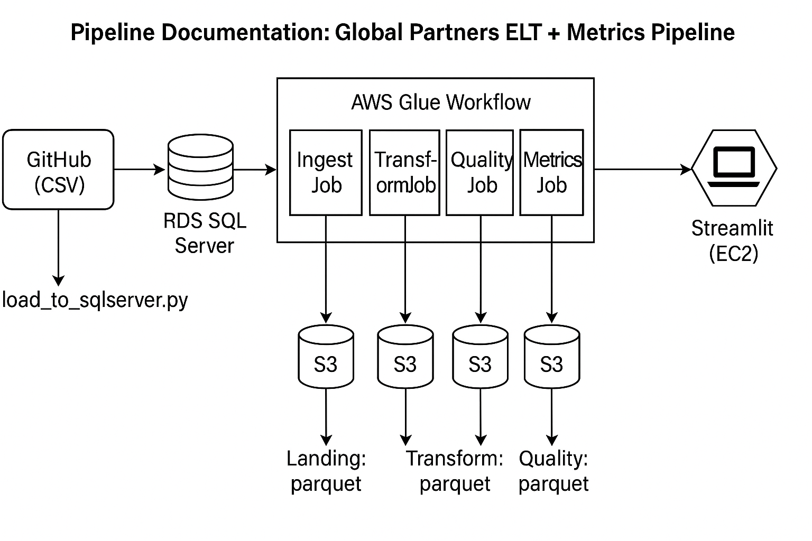

# 📘 Pipeline Documentation: Global Partners ELT + Metrics Pipeline

## 🔍 Project Overview
----
This ELT pipeline starts with CSV data hosted on GitHub, ingests it into **Amazon RDS SQL Server**, then processes it through a series of **AWS Glue jobs**. Cleaned, validated, and transformed data is written to an **S3 Data Lake**, and then analyzed via a **Streamlit dashboard hosted on EC2** that creates an business insights.

---

<p align="center">
  
</p>

---


## 📦 Technologies Used

| Layer              | Service/Tool                        |
|--------------------|-------------------------------------|
| Source             | GitHub (`dataset/`)                 |
| RDS Database       | Amazon RDS SQL Server               |
| ETL Engine         | AWS Glue (Jobs + Workflows)         |
| Storage            | Amazon S3 (Parquet, layered folders)|
| Secrets Mgmt       | AWS Secrets Manager                 |
| Orchestration      | AWS Glue Workflow                   |
| Dashboard UI       | Streamlit (hosted on EC2)           |

## 🔄 Pipeline Stages

### **1. GitHub ➝ RDS SQL Server**
- `load_to_sqlserver.py` GitHub Action loads:
  - `order_items.csv`, `order_item_options.csv`, `date_dim.csv`
- Loads into RDS SQL Server (`globalpartners` DB)

### **2. RDS ➝ AWS Glue Jobs (ETL)**

| Glue Job     | Purpose                                                                 |
|--------------|-------------------------------------------------------------------------|
| **IngestJob**  | Reads from SQL Server and writes raw Parquet to S3: `landing/`         |
| **TransformJob** | Applies mappings, flags anomalies, writes to `transform/` & `error/` |
| **QualityJob**   | Applies YAML-based validation rules, writes to `quality/` & `error/` |
| **MetricsJob**   | Generates RFM, CLV, loyalty, trends metrics, writes to `metrics/`     |

Each job writes **Parquet** to its own S3 folder in `s3://gp-elt-657082399901-dev/`:
```
landing/
transform/
quality/
metrics/
error/
```

### **3. S3 ➝ EC2 Streamlit Dashboard**
- EC2 instance reads from:
  - `metrics/`: for revenue, RFM, CLV, loyalty insights
  - `quality/`: for validation review
- Streamlit exposed on port **8501**, open to public via SG
- SSH enabled for admin via port **22**

## 🔐 Security

| Resource             | Config                                           |
|----------------------|--------------------------------------------------|
| Secrets              | `connection_parameters_sqlserver-dev` (RDS auth) |
| IAM Role for Glue    | Grants access to S3 + Secrets Manager            |
| EC2 Security Group   | Allows TCP:8501 (Streamlit) & TCP:22 (SSH)       |

## 📊 Architecture Diagram (Text)

```
GitHub (CSV)
   ↓
load_to_sqlserver.py
   ↓
Amazon RDS (SQL Server)
   ↓
AWS Glue Workflow
 ┌────────────┬──────────────┬──────────────┬────────────┐
 │ IngestJob │ TransformJob │ QualityJob  │ MetricsJob │
 └────┬──────┴──────┬───────┴──────┬───────┴──────┬─────┘
      ↓             ↓              ↓             ↓
 S3/landing/    S3/transform/   S3/quality/   S3/metrics/
                                                ↓
                                      Streamlit (EC2 on port 8501)
```
